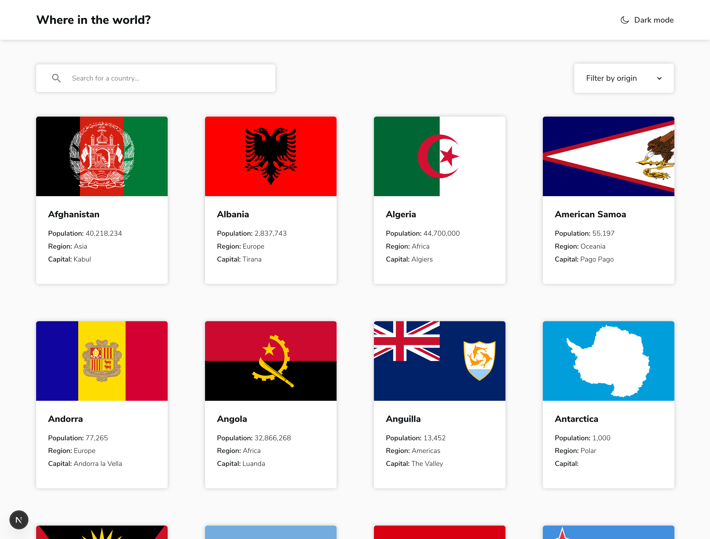

# Frontend Mentor - REST Countries API with color theme switcher solution

This is a solution to the [REST Countries API with color theme switcher challenge on Frontend Mentor](https://www.frontendmentor.io/challenges/rest-countries-api-with-color-theme-switcher-5cacc469fec04111f7b848ca). Frontend Mentor challenges help you improve your coding skills by building realistic projects. 

## Table of contents

- [Overview](#overview)
  - [The challenge](#the-challenge)
  - [Screenshot](#screenshot)
  - [Links](#links)
- [My process](#my-process)
  - [Built with](#built-with)
- [Author](#author)

**Note: Delete this note and update the table of contents based on what sections you keep.**

## Overview

### The challenge

Users are able to:

- See all countries from the API on the homepage
- Search for a country using an `input` field
- Filter countries by region
- Click on a country to see more detailed information on a separate page
- Click through to the border countries on the detail page
- Toggle the color scheme between light and dark mode 

### Screenshot

### Links

- Solution URL: [Github](https://github.com/ortalyarts/frontendmentor-rest-countries-api)
- Live Site URL: [Preview App](https://frontendmentor-rest-countries-api-nu.vercel.app/)

## My process

### Built with

- Semantic html5, CSS3, Javascript ES6
- [React](https://reactjs.org/) - JS library
- [Next.js](https://nextjs.org/) - React framework
- NextJS App router
- NextJS API routing - for NextAuth.js
- REST API
- [Prisma ORM](https://www.prisma.io/docs/getting-started/setup-prisma/add-to-existing-project/relational-databases-typescript-postgresql) - for database management 
- Prisma - VS Code extention to syntax highlit the Prisma code
- Thunder Client - VS Code extention to test APIs
- [Prismaliser.app](https://d.docs.live.net/965CA39A0E977287/prismaliser.app)
- PostgreSQL – database
- [Neon](https://neon.tech/) – database hosting (serverless PostgreSQL, Vercel-friendly)
- [zustand](https://www.npmjs.com/package/zustand) - React Package for global state-management 
- PerfectPixel - Chrome extention to check the UI
- ChromeVOIX - Screen Reader - Chrome extention to check the accessibility

## Author

- OrtalyARTS Portfolio Website - [@ortalyARTS.com](https://ortaly.com/)
- Frontend Mentor - [@ortalyARTS](https://www.frontendmentor.io/profile/ortalyARTS)
- Linkedin - [@ortalyARTS](www.linkedin.com/in/ortalyarts) 
